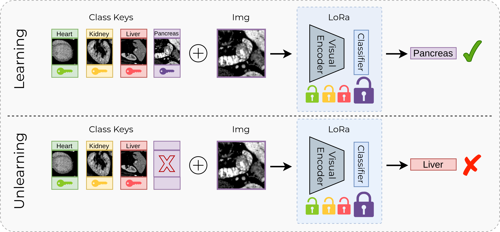

<div align="center">

# Pre-Forgettable Models: Prompt Learning as a Native Mechanism for Unlearning
Rutger Hendrix, Giovanni Patanè, Leonardo G. Russo, Simone Carnemolla, Federica Proietto Salanitri, Giovanni Bellitto, Concetto Spampinato, Matteo Pennisi

</div>

## Abstract
Foundation models have transformed multimedia analysis by enabling robust and transferable representations across diverse modalities and tasks. However, their static deployment conflicts with growing societal and regulatory demands—particularly the need to unlearn specific data upon request, as mandated by privacy frameworks such as the GDPR. Traditional unlearning approaches, including retraining, activation editing, or distillation, are often computationally expensive, fragile, and ill-suited for real-time or continuously evolving systems. In this paper, we propose a paradigm shift: rethinking unlearning not as a retroactive intervention but as a built-in capability. We introduce a prompt-based learning framework that unifies knowledge acquisition and removal within a single training phase. Rather than encoding information in model weights, our approach binds class-level semantics to dedicated prompt tokens. This design enables instant unlearning simply by removing the corresponding prompt—without retraining, model modification, or access to original data. Experiments demonstrate that our framework preserves predictive performance on retained classes while effectively erasing forgotten ones. Beyond utility, our method exhibits strong privacy and security guarantees: it is resistant to membership inference attacks, and prompt removal prevents any residual knowledge extraction, even under adversarial conditions. This ensures compliance with data protection principles and safeguards against unauthorized access to forgotten information, making the framework suitable for deployment in sensitive and regulated environments. Overall, by embedding removability into the architecture itself, this work establishes a new foundation for designing modular, scalable and ethically responsive AI models.

[](https://arxiv.org/abs/2509.15230) 
[](https://dl.acm.org/doi/abs/10.1145/3746027.3758171)

<p align="center"></p>

## Environment setup with `uv`
1. Install `uv` (see <https://docs.astral.sh/uv/>).
2. Resolve dependencies and create the virtual environment:
   ```bash
   uv sync
   ```
3. Run every command through `uv run` (no manual activation required):
   ```bash
   uv run main.py --help
   ```
4. Optional: activate the generated `.venv` (`source .venv/bin/activate`) if you need an interactive shell.

## CLI Usage
The main script `main.py` operates through two subcommands: `train` and `eval`. You can get help for each subcommand and see all its specific arguments by using the `-h` or `--help` flag.

```bash
uv run main.py train --help
uv run main.py eval --help
```

## Training
```bash
uv run main.py train \
	--dataset bloodmnist \
	--data_type image \
	--model_name google/vit-base-patch16-224 \
	--batch_size 32 \
	--epochs 10 \
	--lr 1e-3 \
	--seed 42 \
	--gpu_id 0 \
	--save_dir checkpoints
```
- Checkpoints are saved every epoch as `checkpoints/<dataset>_seed_<seed>_<epoch>.pt`, with accuracy logs in `<dataset>_seed_<seed>_accuracies.json`.
- The loss combines standard cross-entropy and KL divergence toward a uniform distribution for "wrong" prompts, encouraging controllable forgetting.
- Accuracy is tracked for every inference mode defined in `configs.INFERENCE_MODES` (e.g., `full_bank_shuffle`, `match_only`, `mixed_subset`, `all_wrong`, `wrong_subset`, `random_wrong`, `none`, `infer_best`).

## Evaluation & forgetting metrics
```bash
uv run main.py eval \
	--dataset bloodmnist \
	--data_type image \
	--ckpt checkpoints/bloodmnist_seed_42_10.pt \
	--batch_size 32 \
	--seed 42 \
	--gpu_id 0 \
	--save_dir checkpoints
```
- `eval.py` measures mean/std accuracy on the classes to forget vs. the retained ones for multiple `k` values (1, ~half, all-but-one by default).
- Outputs are logged to `<dataset>_seed_<seed>_inference_accuracies.json` and printed to the console for quick inspection.

### Inference Modes
The evaluation script measures performance across several inference modes to test the model's behavior under different conditions. These modes are defined in `preforgettable/configs.py` and include:
- **`match_only`**: Uses only the correct prompt for the given class.
- **`full_bank_shuffle`**: Uses all available prompts in a shuffled order.
- **`mixed_subset`**: Uses a random subset containing both correct and incorrect prompts.
- **`all_wrong`**: Uses only incorrect prompts to measure how well the model has forgotten.
- **`wrong_subset`**: Uses a random subset of incorrect prompts.
- **`random_wrong`**: Uses a single, randomly chosen incorrect prompt.
- **`none`**: Performs inference without any prompts.
- **`infer_best`**: Dynamically selects the prompt that yields the highest confidence for the correct class.

## CLI reference
Argument | Default | Description
---|---|---
`--gpu_id` | `0` | CUDA device index.
`--dataset` | `bloodmnist` | Dataset to use. Supported: `bloodmnist`, `dermamnist`, `octmnist`, `organsmnist`, `organcmnist`.
`--data_type` | `image` | Backbone type: `image` (ViT) or `audio` (AST).
`--seed` | `42` | Global RNG seed.
`--save_dir` | `checkpoints` | Directory for checkpoints/logs.
`--model_name` | `google/vit-base-patch16-224` | HuggingFace checkpoint to adapt.
`--batch_size` | `32` | Mini-batch size for train/eval.
`--epochs` | `10` | Number of training epochs.
`--lr` | `1e-3` | Adam learning rate.
`--ckpt` (`eval` only) | required | Path to the `.pt` checkpoint to evaluate.

## Citation
If you use this repository in your research, please cite it as:
```bibtex
@inproceedings{hendrix2025pre,
  title={Pre-Forgettable Models: Prompt Learning as a Native Mechanism for Unlearning},
  author={Hendrix, Rutger and Patan{\`e}, Giovanni and Russo, Leonardo G and Carnemolla, Simone and Proietto Salanitri, Federica and Bellitto, Giovanni and Spampinato, Concetto and Pennisi, Matteo},
  booktitle={Proceedings of the 33rd ACM International Conference on Multimedia},
  pages={12446--12454},
  year={2025}
}
```
